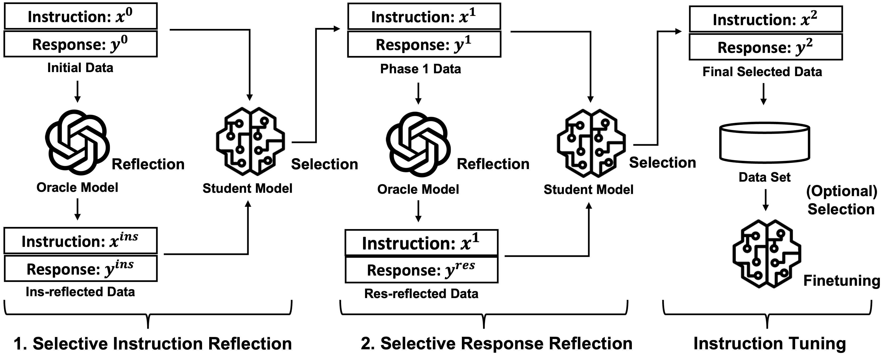
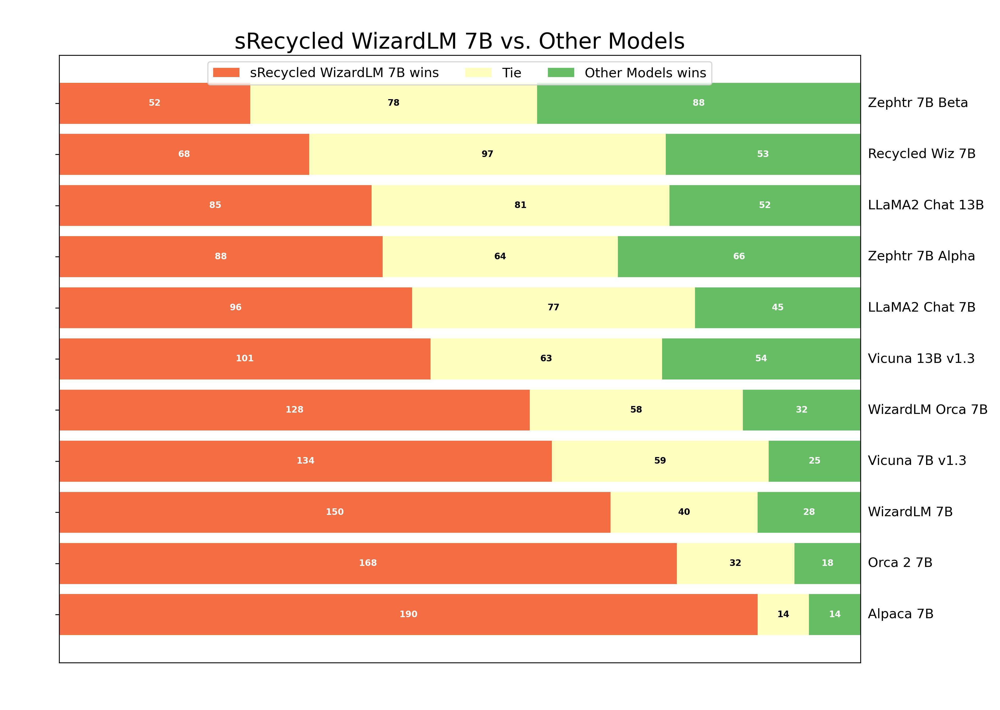
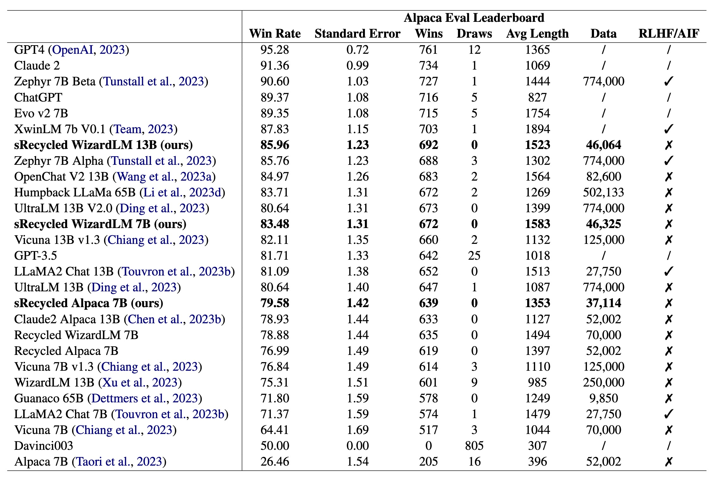
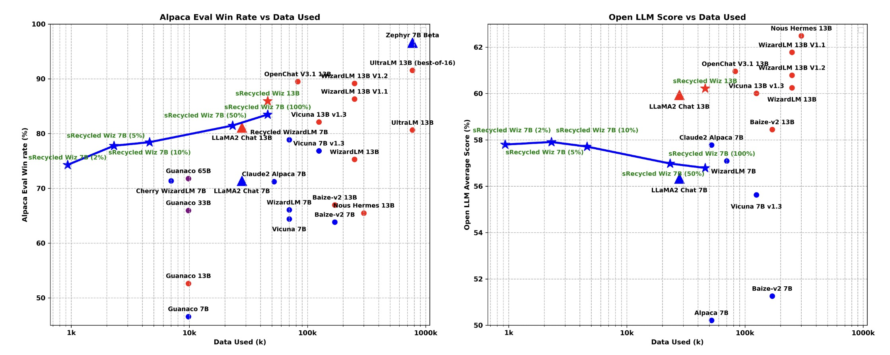

# Reflection-Tuning: An Approach for Data Recycling

[Method V1] [Reflection-Tuning: Data Recycling Improves LLM Instruction-Tuning](https://arxiv.org/abs/2310.11716) (NIPS'23 Wrokshop)<br>
[Method V2] [Selective Reflection-Tuning: Student-Selected Data Recycling for LLM Instruction-Tuning](https://arxiv.org/abs/2402.10110)(ACL'24)

<p align="center" width="40%">
<a ></a>
</p>

This is the repo for the Reflection-Tuning project, which introduces a reflection-based method to improve the quality of instruction-tuning data.

The repo contains:

**Data**: (The detailed description will be found in Section [Data and Model Weights V2](https://github.com/tianyi-lab/Reflection_Tuning?tab=readme-ov-file#data-and-model-weights-v2) )

**Recycled Data (V1)**: [Alpaca](https://huggingface.co/datasets/umd-zhou-lab/recycled_alpaca_v1), [WizardLM70k](https://huggingface.co/datasets/umd-zhou-lab/recycled_wiz70_v1)

**Selective Recycled Data (V2)**: [Alpaca](https://huggingface.co/datasets/umd-zhou-lab/sRecycled_Alpaca), [WizardLM70k](https://huggingface.co/datasets/umd-zhou-lab/sRecycled_Wiz70)

**Overall Reflected Data**: [Alpaca](https://huggingface.co/datasets/umd-zhou-lab/Reflect_Alpaca_All), [WizardLM70k](https://huggingface.co/datasets/umd-zhou-lab/Reflect_Wiz70_All), [WizardLM V2](https://huggingface.co/datasets/umd-zhou-lab/Reflect_WizV2_All)

**Overall Reflected Data IFD scores**:[Alpaca llama2 7b](https://huggingface.co/datasets/MingLiiii/Alpaca_Analysis_llama2_7b), [Alpaca llama2 13b](https://huggingface.co/datasets/MingLiiii/Alpaca_Analysis_llama2_13b), [WizardLM70k llama2 7b](https://huggingface.co/datasets/MingLiiii/Wiz70_Analysis_llama2_7b), [WizardLM70k llama2 13b](https://huggingface.co/datasets/MingLiiii/Wiz70_Analysis_llama2_13b)


(Feel free to email minglii@umd.edu for any questions or feedback.)

## News
- [2024/05] Our paper has been accepted to the **ACL 2024** findings! 
- [2024/02] We release the paper of our Selective Reflection-Tuning.
- [2023/12] We add the complete data of Selective Instruction-Tuning (V2 method) and add the evaluation results. 
- [2023/12] We add the description of Selective Instruction-Tuning (V2 method).
- [2023/10] The V1 paper is accepted by the [NeurIPS 2023 Workshop on Instruction Tuning and Instruction Following](https://an-instructive-workshop.github.io/)
- [2023/10] We released the V2 model and pushed models to the Alpaca Eval leaderboard. 
- [2023/10] We released codes for this project.

## Contents
- [Overview](#overview)
- [Highlights](#highlights)
- [Selective Reflection-Tuning](#selective-reflection-tuning)
- [Install](#install)
- [Code for Reflection](#code-for-reflection)
- [Code for Selection](#code-for-selection)
- [Data and Model Weights V1](#data-and-model-weights-v1)
- [Data and Model Weights V2](#data-and-model-weights-v2)
- [Prompt and Hyperparameters](#prompt-and-hyperparameters)
- [ToDo](#todo)
- [Citation](#citation)


## Overview

### Reflection-Tuning (V1)
We propose a reflection-based method for improving the quality of instruction-response pairs. 
Given the initial base dataset, we are motivated to generate a high-quality version of each data point with an oracle model, chatGPT for instance. 
However, a common problem with using LLMs as judges is the failure to obtain diverse results. 
To overcome this potential problem, inspired by Chain-of-Thought prompting, we further define several specific criteria for the oracle model to follow, and respond to those specific criteria with critical responses, respectively. 
Then the responses to these criteria can serve as bridges (chain of thought) to generate new instruction-response pairs that are satisfied. 

### Selective Reflection-Tuning (V2)

In the original Reflection-Tuning, we propose a data improvement method through Reflection. 
However, two research questions arise: <br>
1. Is the teacher-refined data compatible with the needs of the student model?
2. How does the student model decide which enhanced data are most needed and critical to its training?

To answer the above questions, we propose Selective Reflection-Tuning, in which the student model can decide whether to accept the improvement of the teacher model. 


## Highlights

### Reflection-Tuning (V1)
* In Reflection-Tuning V1, we propose a reflection method that can improve the quality of the instruction-tuning dataset, which is a general method and can be utilized on almost ANY instruction-tuning dataset.
* We implement our method on both [Alpaca](https://github.com/tatsu-lab/stanford_alpaca) and [WizardLM](https://github.com/nlpxucan/WizardLM) datasets and release the newly-generated high-quality recycled datasets.

### Selective Reflection-Tuning (V2)
* We propose an interactive selection pipeline where the oracle model and student model cooperate to build a more coherent and model-compatible instruction-following dataset, which can be further adapted into other self-improvement scenarios.
* Our selectively recycled data has a supreme quality, with only instruction tuning on a few thousand of automatically generated data, our models achieve promising performances compared to models with dozens of thousands of data.
* We present a nuanced evaluation schema r-IFD that quantifies the efficacy and relevance of instruction-response pairs.

## Selective Reflection-Tuning

### Introduction

Existing methods of data enhancement usually do not take a critical criterion into account: **Is the teacher-refined data compatible with the needs of the student model?** These approaches typically do not account for the inherent randomness and potential degradation associated with the generative models' output, leading to an oversight in how the student model responds to these "improved" data samples. Consequently, a mechanism for the student model to selectively integrate these enhancements has been notably absent. To bridge this gap, our work introduces an interactive pipeline wherein an oracle generative model engages in a reflection process to enhance both the instruction and response of a data sample. The student model then evaluates whether to incorporate these improvements based on its unique attributes. This pipeline is versatile and can be adapted to various contexts where data enhancement is needed.

Then, another pivotal question arises: **How does the student model decide which enhanced data are most needed and critical to its training?** This question underpins the challenge of autonomously evaluating the quality of instructions and responses. Common practices involve utilizing sophisticated models like GPT-4 for assessment purposes or employing a secondary judge model equipped with evaluative capabilities. These methods, however, present limitations: they fail to address the discrepancies between the evaluating model and the actual student model undergoing training. Particularly in the latter approach, even though the judge model and the student model share the same structural framework, their weight distributions diverge once endowed with basic evaluative functions. Consequently, the preferences of the judge model may not align with the real student model's requirements. To circumvent these issues, we adopt a statistical method, utilizing the Instruction-Following Difficulty (IFD) score proposed by [Cherry LLM](https://github.com/MingLiiii/Cherry_LLM). This score is derived directly from the raw student model, thereby mitigating potential domain shifts and ensuring that the evaluation is better aligned with the student model’s learning context. We further introduce a reversed version of IFD named reversed-IFD (r-IFD). This metric evaluates how much the response contributes to predicting the corresponding instruction.

### Method

<p align="center" width="80%">
<a ></a>
</p>

We utilize the IFD score to select reflected instructions and utilize the r-IFD score to select reflected responses. 

### Results

Below is the performance for pair-wise comparison between our model and other classic models on the WizardLM test set. We follow the implementation from [AlpaGasus](https://github.com/Lichang-Chen/AlpaGasus) and [Cherry LLM](https://github.com/MingLiiii/Cherry_LLM), which greatly eliminates the potential position bias of GPT4. The prompts can be found in our [paper](https://arxiv.org/abs/2310.11716), and the data, code, and use cases for evaluation can be found in [Cherry LLM Repo](https://github.com/MingLiiii/Cherry_LLM?tab=readme-ov-file#evaluation). 

<p align="center" width="80%">
<a ></a>
</p>

Below are the performance results on the Alapca Eval leaderboard. “Data” represents the number of data used for fine-tuning. “RLHF/AIF” represents whether the model utilizes an additional RLHF or RLAIF process.

<p align="center" width="80%">
<a ></a>
</p>

Below are comparisons between model performances and data used for fine-tuning on the Alapca Eval benchmark and the open LLM leaderboard. We utilize star markers to represent our models, dot markers to represent other instruction-tuned models and triangle markers to represent RLHF/AIF models. Blue markers represent 7B models, red markers represent 13B models and purple markers represent models with larger weights.

<p align="center" width="80%">
<a ></a>
</p>

**It is astonishing that with less than 1k automatically generated instruction samples (2%, 926 samples), our model achieves really promising performance (74.29 win rate on alpaca eval rate, 57.80 averaged score on Open LLM Leaderboard), showing the supreme quality of our sRecycled data.**

## Install

Install the dependencies with `pip install -r requirements.txt`

## Code for Reflection
#### Note: 
Reflecting on the whole dataset containing dozens of thousands of data will consume a lot, so we recommend using some tiny datasets for the beginning, for example, cherry data from [Cherry LLM](https://github.com/MingLiiii/Cherry_LLM). Experiments show that simply reflecting on a subset of high-quality data can also get a promising performance. <br>
In the below scripts, we directly run on ```data/cherry_alpaca_v1/cherry_alpaca_5_percent_compressed.json``` which contains only approximately 3k [Alpaca](https://github.com/tatsu-lab/stanford_alpaca) data. 

### Reflection on Instruction


1. Reflection
```
python reflection_code/reflecn_instruction.py \
    --data_path data/cherry_alpaca_v1/cherry_alpaca_5_percent_compressed.json \
    --save_path cherry_alpaca_5_percent_reflect_ins_raw.json \
    --api_key xxx 
```
```--data_path```: The targeted dataset in the Alpaca format <br>
```--save_path```: The path to save the raw reflection texts <br>
```--api_key```: Your openAI key

2. Extract the instruction-response pairs:
```
python reflection_code/reflect_instruction_postprocess.py \
    --raw_data_path cherry_alpaca_5_percent_reflect_ins_raw.json \
    --ori_data_path data/cherry_alpaca_v1/cherry_alpaca_5_percent_compressed.json \
    --save_path cherry_alpaca_5_percent_reflect_ins.json \
    --save_intermediate_path cherry_alpaca_5_percent_reflect_ins_mid.json \
    --api_key xxx 
```
```--raw_data_path```: The path that saves the raw reflection texts <br>
```--ori_data_path```: The original targeted dataset in the Alpaca format <br>
```--save_path```: The path to save formated dataset in the Alpaca format <br>
```--save_intermediate_path```: The path to save the middle results <br>
```--api_key```: Your openAI key

### Reflection on Response
1. Reflection
```
python reflection_code/reflect_response.py \
    --data_path data/cherry_alpaca_v1/cherry_alpaca_5_percent_compressed.json \
    --save_path cherry_alpaca_5_percent_reflect_res_raw.json \
    --api_key xxx 
```

2. Extract the instruction-response pairs:
```
python reflection_code/reflect_response_postprocess.py \
    --raw_data_path cherry_alpaca_5_percent_reflect_res_raw.json \
    --ori_data_path data/cherry_alpaca_v1/cherry_alpaca_5_percent_compressed.json \
    --save_path cherry_alpaca_5_percent_reflect_res.json \
    --save_intermediate_path cherry_alpaca_5_percent_reflect_res_mid.json \
    --api_key xxx 
```

Note: When reflecting on the instruction, we first compress the instruction and input it into one single instruction for easier processing by using chatGPT. 
The whole compressed Alpaca data can be found in the data folder. <br>
Note: The extraction of reflection results is based on regular expression and, thus is not perfect. We will release the raw output before the extraction in the future. 

## Code for Selection

1. Generate Data Statistics
```
python selection_code/data_analysis.py \
    --data_path data/cherry_alpaca_v1/cherry_alpaca_5_percent_compressed.json \
    --save_path cherry_alpaca_5_percent_analysis.jsonl \
    --model_name_or_path meta-llama/Llama-2-7b-hf 
```
This code calculates the necessary statistics for calculating IFD scores and r-IFD scores. <br>
Please feel free to customize your own training prompt and model. 

2. Put the Statistics to Original Data
```
python selection_code/put_analysis_to_data.py \
    --pt_data_path cherry_alpaca_5_percent_analysis.jsonl \
    --json_data_path data/cherry_alpaca_v1/cherry_alpaca_5_percent_compressed.json \
    --json_save_path cherry_alpaca_5_percent_with_analysis.json 
```
After obtaining data with IFD scores and r-IFD scores, you can compare these scores to make the customized selection. 

## Data and Model Weights V1

The following table provides a comparison between our recycled models (V1) and baseline models on the AlpacaEval Leaderboard and Huggingface Open LLM Leaderboard. <br>

The Recycled Alpaca Data can be found here: [[hf-Link]](https://huggingface.co/datasets/umd-zhou-lab/recycled_alpaca_v1) <br>
The Recycled WizardLM (70k) Data can be found here: [[hf-Link]](https://huggingface.co/datasets/umd-zhou-lab/recycled_wiz70_v1) <br>

|                          | **AlpacaEval** || **Avg** | **ARC** | **HellaSwag** | **MMLU** | **TruthfulQA** || **Model**|
|--------------------------|:--------------:|:-:|:-----------:|:-------:|:-------------:|:-------:|:--------------:|:-:|:-:|
| **Alpaca 7B**            | 26.46          || 50.21       | 42.65   | 76.91         | 41.73   | 39.55          ||/|
| **Recycled Alpaca 7B V1.0**   | 76.99          || 56.18| 53.92   | 77.68         | 47.55   | 45.55          ||[[hf-Link]](https://huggingface.co/umd-zhou-lab/recycled-alpaca-7b-v1.0)|
| **Recycled Alpaca 13B V1.0**  | 83.42          || 58.93| 58.70   | 80.80         | 53.11   | 43.12          ||[Link]|
|||||||||||
| **WizardLM 7B**          | 67.64          || 54.18       | 51.60   | 77.70         | 42.70   | 44.70          ||/|
| **Recycled WizardLM 7B V1.0** | 78.88          || 56.21       | 53.92   | 77.05         | 48.35   | 45.52         ||[[hf-Link]](https://huggingface.co/umd-zhou-lab/recycled-wizardlm-7b-v1.0)|
|||||||||

## Data and Model Weights V2

In the repo, we name our Selective Reflection-Tuning as the V2 method for simplicity. 

The following table provides a comparison between our sRecycled models (V2) and baseline models on the AlpacaEval Leaderboard and Huggingface Open LLM Leaderboard. <br>

The data used for training llama2-7b model can be directly found here: <br>
**Selective Recycled Data (V2)**: [Alpaca](https://huggingface.co/datasets/umd-zhou-lab/sRecycled_Alpaca), [WizardLM70k](https://huggingface.co/datasets/umd-zhou-lab/sRecycled_Wiz70)<br>
The above data contains the model-selected data from data **reflected on both instruction and response** and data **reflected on response**.<br>

The complete data reflected on instruction, response or both can be found here:<br>
**Overall Reflected Data**: [Alpaca](https://huggingface.co/datasets/umd-zhou-lab/Reflect_Alpaca_All), [WizardLM70k](https://huggingface.co/datasets/umd-zhou-lab/Reflect_Wiz70_All), [WizardLM V2](https://huggingface.co/datasets/umd-zhou-lab/Reflect_WizV2_All)<br>

The complete data statistics on (loss, and perplexity) on llama2-7b and llama2-13b model can be found here, which can be directly used for computing IFD scores:<br>
**Overall Reflected Data IFD scores**:[Alpaca llama2 7b](https://huggingface.co/datasets/MingLiiii/Alpaca_Analysis_llama2_7b), [Alpaca llama2 13b](https://huggingface.co/datasets/MingLiiii/Alpaca_Analysis_llama2_13b), [WizardLM70k llama2 7b](https://huggingface.co/datasets/MingLiiii/Wiz70_Analysis_llama2_7b), [WizardLM70k llama2 13b](https://huggingface.co/datasets/MingLiiii/Wiz70_Analysis_llama2_13b)<br>


|                          | **AlpacaEval** || **Avg** | **ARC** | **HellaSwag** | **MMLU** | **TruthfulQA** || **Model**|
|--------------------------|:--------------:|:-:|:-----------:|:-------:|:-------------:|:-------:|:--------------:|:-:|:-:|
| **Alpaca 7B**            | 26.46          || 50.21       | 42.65   | 76.91         | 41.73   | 39.55          ||/|
| **Recycled Alpaca 7B V2.0**   |     79.58      || 56.05 |  54.01  |   78.07      |  46.69  |    45.41       ||[[hf-Link]](https://huggingface.co/umd-zhou-lab/recycled-alpaca-7b-v2.0)|
|||||||||||
| **WizardLM 7B**          | 67.64          || 54.18       | 51.60   | 77.70         | 42.70   | 44.70          ||/|
| **Recycled WizardLM 7B V2.0** |     83.48      ||   56.79     |  54.78 |     77.86     |  45.63  |    48.91     ||[[hf-Link]](https://huggingface.co/umd-zhou-lab/recycled-wizardlm-7b-v2.0)|
|||||||||

## Prompt and Hyperparameters

We use the prompt from [FastChat](https://github.com/lm-sys/FastChat):

```
A chat between a curious user and an artificial intelligence assistant. The assistant gives helpful, detailed, and polite answers to the user's questions. USER: Hi ASSISTANT: Hello.</s>USER: Who are you? ASSISTANT: I am ...</s>......
```

| Hyperparameter | Global Batch Size | Learning rate | Epochs | Max length | Weight decay | Warmup Rate |
| --- | ---: | ---: | ---: | ---: | ---: | ---: |
| Recycled Models (7B) | 128 | 2e-5 | 3 | 2048 | 0 | 0.03 |
| Recycled Models (13B) | 128 | 2e-5 | 3 | 2048 | 0 | 0.03 |

## ToDo
- [x] Release the code, data, and models for V1.
- [x] Release the method for Selective Reflection-Tuning (V2).
- [x] Release the data for Selective Reflection-Tuning (V2). 
- [ ] Release the models for Selective Reflection-Tuning (V2). 

## Citation

Please consider citing our paper if you think our codes, data, or models are useful. Thank you!
```
@article{Li2024SelectiveRS,
  title={Selective Reflection-Tuning: Student-Selected Data Recycling for LLM Instruction-Tuning},
  author={Ming Li and Lichang Chen and Jiuhai Chen and Shwai He and Jiuxiang Gu and Tianyi Zhou},
  journal={ArXiv},
  year={2024},
  volume={abs/2402.10110},
  url={https://api.semanticscholar.org/CorpusID:267682220}
}

@inproceedings{li-etal-2024-quantity,
    title = "From Quantity to Quality: Boosting {LLM} Performance with Self-Guided Data Selection for Instruction Tuning",
    author = "Li, Ming  and
      Zhang, Yong  and
      Li, Zhitao  and
      Chen, Jiuhai  and
      Chen, Lichang  and
      Cheng, Ning  and
      Wang, Jianzong  and
      Zhou, Tianyi  and
      Xiao, Jing",
    editor = "Duh, Kevin  and
      Gomez, Helena  and
      Bethard, Steven",
    booktitle = "Proceedings of the 2024 Conference of the North American Chapter of the Association for Computational Linguistics: Human Language Technologies (Volume 1: Long Papers)",
    month = jun,
    year = "2024",
    address = "Mexico City, Mexico",
    publisher = "Association for Computational Linguistics",
    url = "https://aclanthology.org/2024.naacl-long.421",
    pages = "7595--7628",
}

@inproceedings{
li2023reflectiontuning,
title={Reflection-Tuning: Recycling Data for Better Instruction-Tuning},
author={Ming Li and Lichang Chen and Jiuhai Chen and Shwai He and Tianyi Zhou},
booktitle={NeurIPS 2023 Workshop on Instruction Tuning and Instruction Following},
year={2023},
url={https://openreview.net/forum?id=xaqoZZqkPU}
}
```

